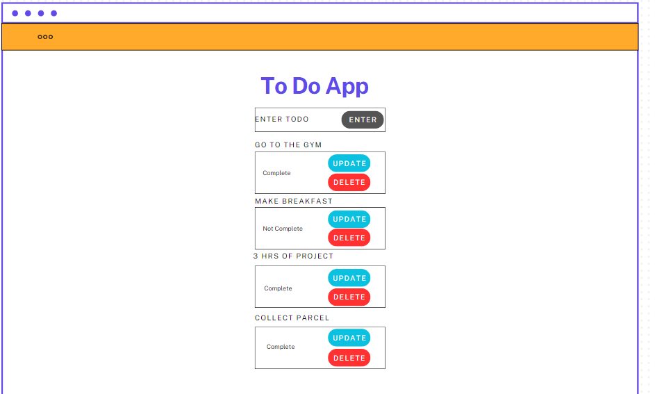
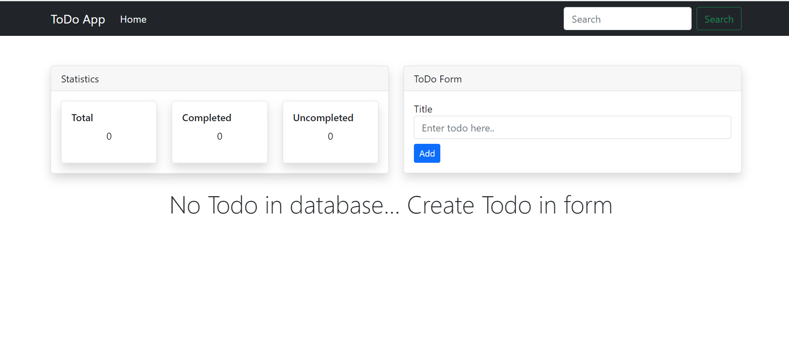
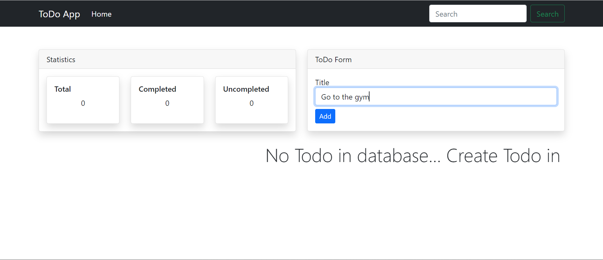
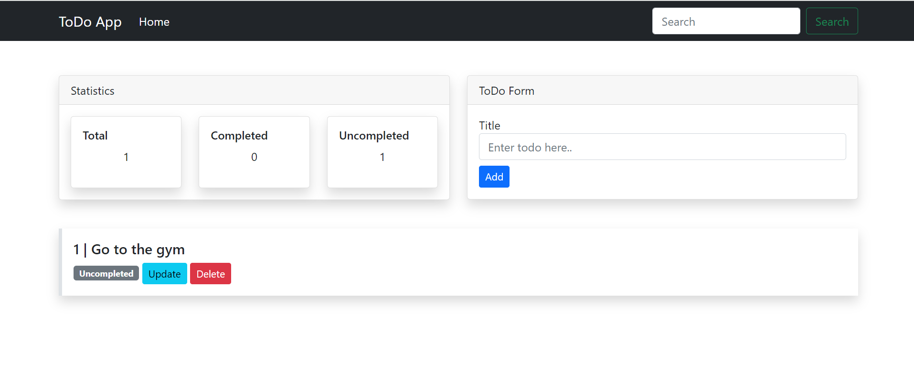
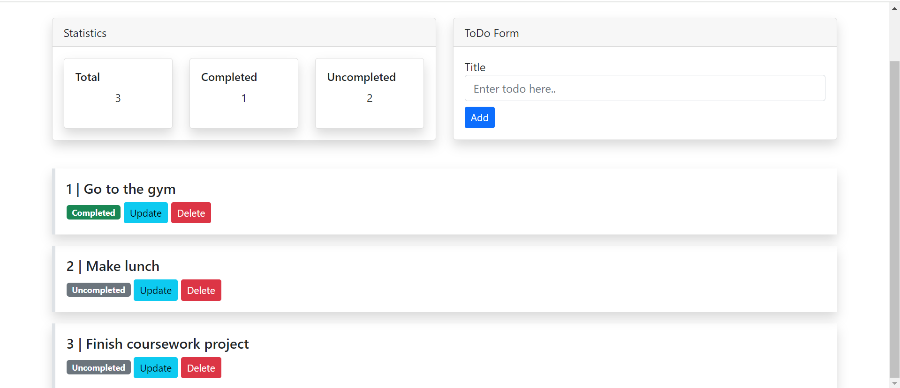
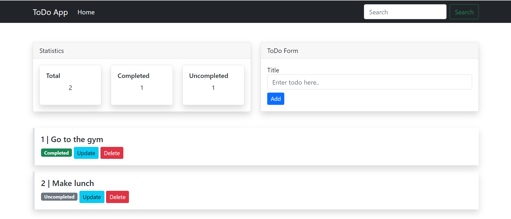
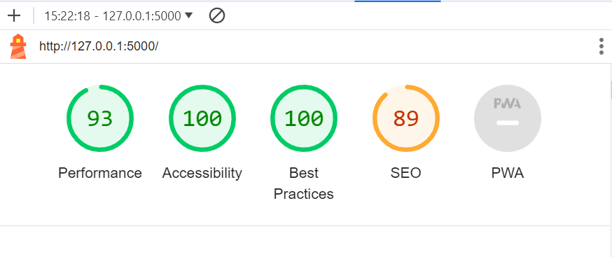

# FlaskApp
### This Todo App incorporates Flask and SQLAlchemy where you can Add, Update and Delete your day-to-day tasks.

# Site Goals
### The purpose of this Todo App is to be able to give the user accessability in creating a daily task, then able able to update with completion and then delete if wanted.

# WireFrames
### This was a base wireframe fro my intial idea but I did change my vision slightly as I progressed through the project.

 
Desktop Wireframe

 

# Features
## Home Page without Tasks
* This is the look of the Home Page without any tasks. A marquee banner moves left to right across the screen if there are no tasks set in the application.

## Inputting Task into textbox
* You have to type into the textbox to add a task and then click the Add button.

## First Task Added
* As you can see in the image, once you click add the task title card with its options are added to the task section with the label of Uncompleted.

## Completing a ToDo Task 
* If you click Update, the Uncompleted box will change to say Completed with a green background to indicate you are completed that task.

## Deleting a Task
* As you can see, I have deleted the bottom task from the page byt clicking the red Delete button.

# Technologies Used
* HTML
* Python
* Flask
* SQLAlchemy
* Bootstrap5

# Testing 

## Testing Process
# Creating Virtual Environment
I created and tested the virtual environment by doing the following:
1. python3 -m venv .venv
2. .venv/bin/activate
3. pip install Flask
4. run flask 
This process created and activated to virtual environment and then tested it on port 5000.

# Testing if the database works and links up
1. Created a new Todo Task and click Add
2. In the terminal it shows POST and the specifc time the Task was added
3. If this did not show, I was missing a POST or my grammar needed to be checked

# Deployment
Unable to deploy to GitHub Pages but the screenshots above depict the live application. For some reason my Github Pages is deploying my README file instead.